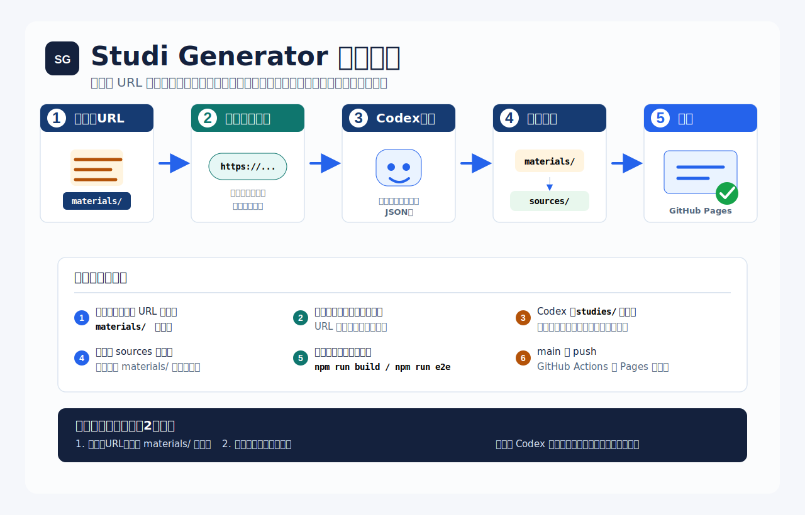

# Studi Generator

`web-studi-generator` は、Codex が資料や Web ページ URL を読み取り、GitHub Pages 用の静的な学習サイトを生成するための土台です。

これはフロントエンドの編集アプリではありません。リポジトリ内の `materials/` とチャットで渡された URL を入力として、`studies/` の JSON を更新し、`dist/` に公開用 HTML/CSS/JS を生成します。



## 使い方

1. ローカル資料を一時投入用の `materials/` に置きます。
2. Web ページを使いたい場合は、調査対象 URL を `materials/` 内の Markdown またはテキストにも保存し、Codex とのチャットでも URL を送ります。
3. Codex がチャット指示を実行トリガーとして資料と URL を読み取り、`studies/<study-id>/study.config.json` と `studies/<study-id>/data/*.json` を更新します。
4. `npm run generate` または `npm run build` で `dist/` に静的サイトを生成します。
   科目別の模擬試験を定義した study は `dist/studies/<slug>/mock-test/<exam-id>/` も生成します。
5. `npm run e2e` で生成ページと模擬テストの操作を確認します。
6. 処理済み資料は `studies/<study-id>/sources/` に移動し、`materials/` は空に戻します。
7. `main` に push すると GitHub Actions が `dist/` を GitHub Pages に公開します。

## 現在のサンプル学習サイト

- 基本情報技術者試験
- 色彩検定
- 狩猟免許（わな）

## リポジトリ構成

```text
materials/              実行ごとの一時資料置き場。処理後は空に戻す
studies/                学習サイト定義と生成済み JSON データ
templates/              静的 HTML/CSS/JS テンプレート
scripts/                ジェネレーターと検証ヘルパー
dist/                   GitHub Pages 用の生成結果。Git 管理外
.github/workflows/      GitHub Pages 自動公開 workflow
```

## 生成されるページの機能

生成される模擬テストページには、以下の機能があります。

- 1ページに複数問 / 1ページに1問の表示切替
- 科目別模擬試験ページ
- カテゴリ絞り込み
- 全体の解答時間設定
- 出題する問題数の指定
- 経過時間
- 残りの解答時間
- 平均回答時間
- 残り問題数
- 残問1問あたりに使える時間
- 表示フォント設定
- フォントサイズ設定
- 選択式回答
- 出題開始ごとの選択肢順と解答記号のランダム化
- 正誤フィードバック
- 図・画像付き問題文

対応する問題形式:

- 択一式
- 空欄補充形式
- 複数選択式
- 組み合わせ問題
- 個数問題
- 正誤方式

## ローカル実行

```powershell
npm install
npm run generate
npm run preview
```

ブラウザで `http://127.0.0.1:4173` を開きます。

## 検証

```powershell
npm run lint
npm test
npm run build
npm run e2e
npm run docs:zip
```

`npm run build` は `npm run generate` の別名です。公開対象は生成された `dist/` ディレクトリです。

## 公開

`main` に push すると `.github/workflows/pages.yml` が実行されます。workflow は依存関係のインストール、検証、`dist/` 生成、GitHub Pages へのデプロイを行います。

公開先:

```text
https://sunmax0731.github.io/web-studi-generator/
```

## 関連ドキュメント

- [docs/materials.md](docs/materials.md)
- [docs/generation-format.md](docs/generation-format.md)
- [docs/publishing.md](docs/publishing.md)
- [docs/test-plan.md](docs/test-plan.md)
- [docs/qcds-evaluation.md](docs/qcds-evaluation.md)
- [docs/qcds-strict-metrics.json](docs/qcds-strict-metrics.json)
- [docs/release-checklist.md](docs/release-checklist.md)
